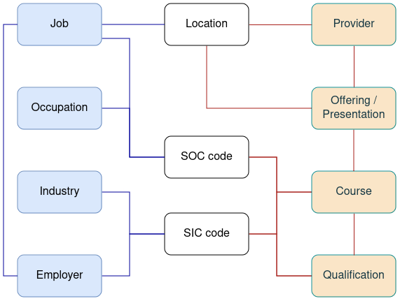
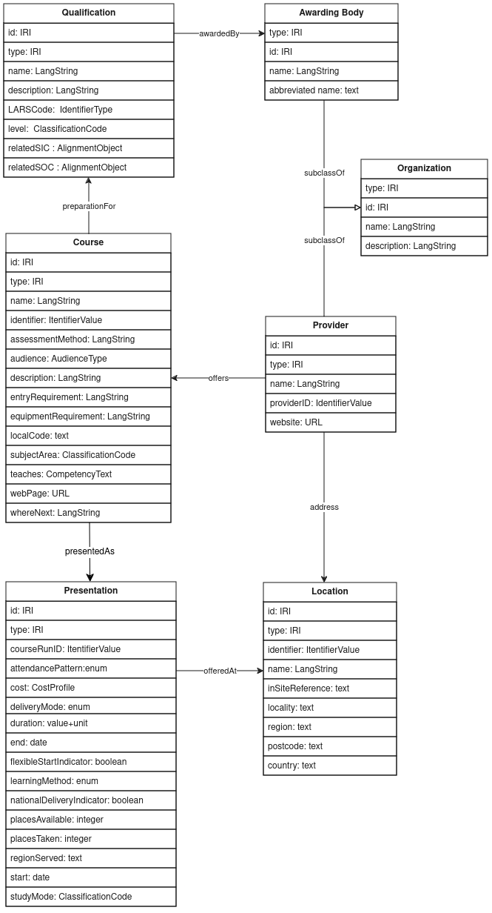
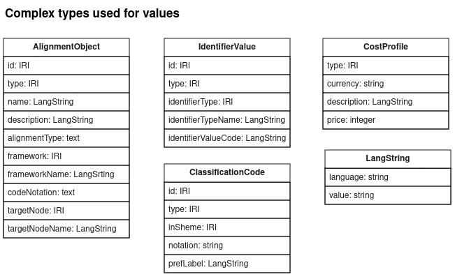

# Data Schema Overview

The data standard created for phase on of the project followed the following logical model:

On the left hand side we show the main entities at play in employment. A **Job** is a position with an **Employer**, an **Occupation** is what a person does for their trade or profession regardless of who employs them. An **Occupation** may be associated with many classification codes, but the SOC code is the one we are interested in here.

On the right we show the main entities in the education and training arena. All terms will be defined later, but a **Course** may be offered or presented repeatedly over the years and in various places as **Presentations**s, by an education Provider; successful completion of a Course will lead to a **Qualification**.

In the middle we reflect that **Location** is a common and important factor linking Providers, Course Offerings, Employers and Jobs. We also reflect that **SIC** and **SOC** codes can be used to link the topic of Qualifications (especially vocational qualifications) to relevant industries and occupations respectively (and by implication Jobs and Employers).

Detailed Schema
The figure below shows the detailed data model used for describing courses, presentations and the qualifications that they lead to.

In order to keep the diagram above simple, some of the complex data values which require instances of classes to represent are shown as attributes rather than related object types. The more important of these are detailed below.

The Alignment Object allows for data about industry and how the alignment was arrived at to be provided, a capability that may be extended in future iterations of the model. 

## Note

This model above illustrates the concpetual model. The details of how these types are implemented in concrete JSON / JSON-LD and other RDF serializations will depend on details of how they are mapped, as described below, and the requirements of each serialization. The mapping below, the Json Schema and SHACL files describe and define these variations in detail.

# Class and Property Definitions, with mapping to CTDL

In order to express the data model in RDF for linked data, the types, attributes and relationships need to be expressed using an RDF vocabulary, that is using RDF classes, properties, etc. Ideally these will come from an existing vocabulary, and phase 1 of this project showed CTDL to be a suitable source of vocabulary terms. The main entity types are mapped as:

**Qualification** → [ceterms:Credential](https://purl.org/ctdl/terms/Credential) (and subtypes)
**Course** → [ceterms:LearningOpportunity](https://purl.org/ctdl/terms/LearningOpportunity) 
**Presentation** → [ceterms:ScheduledOffering](https://purl.org/ctdl/terms/ScheduledOffering) 
**Awarding Body** → [ceterms:CredentialOrganization](https://purl.org/ctdl/terms/CredentialOrganization) 
**Provider** → [ceterms:CredentialOrganization](https://purl.org/ctdl/terms/CredentialOrganization)
**Location** → [ceterms:lace](https://purl.org/ctdl/terms/Place)

Where ceterms: is shorthand for https://purl.org/ctdl/terms/

These are the IRIs that should be used to identify the type of relevent data objects.

## RDF Vocabularies for Properties

Most attributes and relationships shown in the abstract model can also be mapped to terms from CTDL. Where no suitable property in CTDL could be found, a property for schema.org was used, or failing that a new property is created in a vocabulary specific to Data for Change Makers.

Each term from an RDF vocabulary is identified with an IRI, and as a shorthand a prefix is used to compact those IRIs. The prefixes used are listed below. 

| Prefix | URI Vocabulary | Name         |
|--------|----------------|--------------|
| ceterms: | https://purl.org/ctdl/terms/ |CTDL |
| sdo: | https://schema.org/ | Schema.Org| 
| dfcm: | https://example.org/dfcm/terms/  |Data for change makers(*) |

(* dfcm is a placeholder for the vocabulary created where no term in CTDL or Schema.Org could be found.)

## Vocabulary Defintion and Mapping

The table below provides definitions for the classes and properties in the model above, and a link to the RDF class or property that will be used to express the data. The source of the definition is indicated in parentheses []. Unless otherwise indicated by use of a prefix, the RDF classes and properties are from the CTDL vocabulary.

### Qualification

**Definition:** A formal proof of successfully completed learning according to an agreed standard. [[UNESCO](https://unevoc.unesco.org/home/TVETipedia+Glossary/lang=en/show=term/term=Qualification#start)]

| Property | Definition      | Mapping to RDF |
|----------|-----------------|----------------|
| type | The category or type of qualification being described [Schema.Org](https://schema.org/credentialCategory) | [rdf:type](https://www.w3.org/TR/rdf-schema/#ch_type)
| name | Full official name of the qualification using standard abbreviations if used in official documentation [XCRI] | [name](https://purl.org/ctdl/terms/name) |
| description | General summary of the nature of the qualification [XCRI] | [description](https://purl.org/ctdl/terms/description) |
| awardedBy | The awarding body that offers this qualification. | [offeredBy](https://purl.org/ctdl/terms/offeredBy)
| LARSCode | The learning aims (LARS/QAN) code of the qualification. | [identifier](https://purl.org/ctdl/terms/identifier)→ [IdentifierValue](https://purl.org/ctdl/terms/IdentifierValue) – [identifierValueCode](https://purl.org/ctdl/terms/identifierValueCode) 
| level | Information about the progression through an educational or training context represented by the qualification [XCRI] | [sdo:educationalLevel](http://schema.org/educationalLevel) |
| relatedSIC | A valid five digit SIC code for an industry that the qualification is relevant to, and the specific version of SIC used.  |[industryType](https://purl.org/ctdl/terms/industryType) → [CredentialAlignmentObject](https://purl.org/ctdl/terms/CredentialAlignmentObject) – [codedNotation](https://purl.org/ctdl/terms/codedNotation) |
| relatedSoc | A valid four digit SOC code for an occupation that the qualification is relevant to, and the specific version of SOC used. | [occupationType](https://purl.org/ctdl/terms/occupationType) → [CredentialAlignmentObject](https://purl.org/ctdl/terms/CredentialAlignmentObject) – [codedNotation](https://purl.org/ctdl/terms/codedNotation)  |

