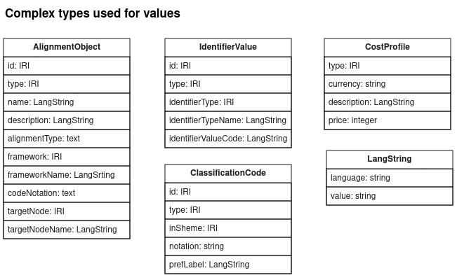

# Data Schema Overview

The data standard created for phase on of the project followed the following logical model:

On the left hand side we show the main entities at play in employment. A **Job** is a position with an **Employer**, an **Occupation** is what a person does for their trade or profession regardless of who employs them. An **Occupation** may be associated with many classification codes, but the SOC code is the one we are interested in here.

On the right we show the main entities in the education and training arena. All terms will be defined later, but a **Course** may be offered or presented repeatedly over the years and in various places as **Presentations**s, by an education Provider; successful completion of a Course will lead to a **Qualification**.

In the middle we reflect that **Location** is a common and important factor linking Providers, Course Offerings, Employers and Jobs. We also reflect that **SIC** and **SOC** codes can be used to link the topic of Qualifications (especially vocational qualifications) to relevant industries and occupations respectively (and by implication Jobs and Employers).

Detailed Schema
The figure below shows the detailed data model used for describing courses, presentations and the qualifications that they lead to.

In order to keep the diagram above simple, some of the complex data values which require instances of classes to represent are shown as attributes rather than related object types. The more important of these are detailed below.

The Alignment Object allows for data about industry and how the alignment was arrived at to be provided, a capability that may be extended in future iterations of the model. 

## Note

This model above illustrates the concpetual model. The details of how these types are implemented in concrete JSON / JSON-LD and other RDF serializations will depend on details of how they are mapped, as described below, and the requirements of each serialization. The mapping below, the Json Schema and SHACL files describe and define these variations in detail.

# Class and Property Definitions, with mapping to CTDL

In order to express the data model in RDF for linked data, the types, attributes and relationships need to be expressed using an RDF vocabulary, that is using RDF classes, properties, etc. Ideally these will come from an existing vocabulary, and phase 1 of this project showed CTDL to be a suitable source of vocabulary terms. 

Most attributes and relationships shown in the abstract model can also be mapped to terms from CTDL. Where no suitable property in CTDL could be found, a property for schema.org was used, or failing that a new property is created in a vocabulary specific to Data for Change Makers.

Each term from an RDF vocabulary is identified with an IRI, and as a shorthand a prefix is used to compact those IRIs. The prefixes used are listed below. 

| Prefix | URI Vocabulary | Name         |
|--------|----------------|--------------|
| ceterms: | https://purl.org/ctdl/terms/ |CTDL |
| sdo: | https://schema.org/ | Schema.Org| 
| skos: | http://www.w3.org/2004/02/skos/core# | Simple Knowledge Organization System
| cmco: | https://example.org/dfcm/terms/  |Data for change makers(*) |

(* dfcm is a placeholder for the vocabulary created where no term in CTDL or Schema.Org could be found.)

## Vocabulary Definition and Mapping

The table below provides definitions for the classes and properties in the model above, and a link to the RDF class or property that will be used to express the data. The source of the definition is indicated in parentheses []. Unless otherwise indicated by use of a prefix, the RDF classes and properties are from the CTDL vocabulary.

The `type` and `id` properties are not generally shown mapped to rdf in the tables below; `type` will always be the  [rdf:type](https://www.w3.org/TR/rdf-schema/#ch_type) property, and `id` will always be the IRI used to identify the subject of RDF statements.

### Qualification

**Definition:** A formal proof of successfully completed learning according to an agreed standard. [[UNESCO](https://unevoc.unesco.org/home/TVETipedia+Glossary/lang=en/show=term/term=Qualification#start)]

**RDF Type:** [Credential](https://purl.org/ctdl/terms/Credential) (used in parallel with more specific types).

| Property | Definition      | Mapping to RDF |
|----------|-----------------|----------------|
| type | The category or type of qualification being described [Schema.Org](https://schema.org/credentialCategory) | 
| name | Full official name of the qualification using standard abbreviations if used in official documentation [XCRI] | [name](https://purl.org/ctdl/terms/name) |
| description | General summary of the nature of the qualification [XCRI] | [description](https://purl.org/ctdl/terms/description) |
| awardedBy | The awarding body that offers this qualification. | [offeredBy](https://purl.org/ctdl/terms/offeredBy)
| LARSCode | The learning aims (LARS/QAN) code of the qualification. | [identifier](https://purl.org/ctdl/terms/identifier)→ [IdentifierValue](https://purl.org/ctdl/terms/IdentifierValue) – [identifierValueCode](https://purl.org/ctdl/terms/identifierValueCode) 
| level | Information about the progression through an educational or training context represented by the qualification [XCRI] | [sdo:educationalLevel](http://schema.org/educationalLevel) |
| relatedSIC | A valid five digit SIC code for an industry that the qualification is relevant to, and the specific version of SIC used.  |[industryType](https://purl.org/ctdl/terms/industryType) → [CredentialAlignmentObject](https://purl.org/ctdl/terms/CredentialAlignmentObject) – [codedNotation](https://purl.org/ctdl/terms/codedNotation) |
| relatedSoc | A valid four digit SOC code for an occupation that the qualification is relevant to, and the specific version of SOC used. | [occupationType](https://purl.org/ctdl/terms/occupationType) → [CredentialAlignmentObject](https://purl.org/ctdl/terms/CredentialAlignmentObject) – [codedNotation](https://purl.org/ctdl/terms/codedNotation)  |

### Course

**Defintion:** Structured and unstructured learning and development opportunities based in direct experience, formal and informal study, observation, and involvement in discourse and practice. [[CTDL Learning Opportunity](https://credreg.com/ctdl/terms#LearningOpportunity)]

**RDF Type:** [LearningOpportunity](https://purl.org/-ctdl/terms/LearningOpportunity) 

| Property | Definition      | Mapping to RDF |
|----------|-----------------|----------------|
| name |Name of the course [XCRI] | [name](https://purl.org/ctdl/terms/name) |
| description|  General summary of the course [XCRI] |[description](https://purl.org/ctdl/terms/description) |
| assessmentMethod | The ways a learner will be assessed. [ESFA] | [assessmentMethodDescription](https://purl.org/ctdl/terms/assessmentMethodDescription) |
| audience | Information that will help the learner decide whether this course is suitable for them, the learning experience and opportunities they can expect from the course. [ESFA] | [sdo:audience](http://schema.org/audience) |
| entryRequirement | Specific skills, licences, vocational or academic requirements. [ESFA] | [entryCondition](https://purl.org/ctdl/terms/entryCondition)→ [ConditionProfile](https://purl.org/ctdl/terms/ConditionProfile) – description |
| equipmentRequired | What the learner will need to access or bring to the course. [ESFA] | cmco:equipmentRequired |
| localCode | Identifier of the course used by the provider [based on schema.org] | [codedNotation](https://purl.org/ctdl/terms/codedNotation) |
| preparationFor | Qualification for which this course is preparation | [isPreparationFor](https://purl.org/ctdl/terms/isPreparationFor) |
| presentedAs | Presentation of this course. | [hasOffering](https://purl.org/ctdl/terms/hasOffering) |
| subjectArea | Topic of the course [XCRI] | [subject](https://purl.org/ctdl/terms/subject)→ [skos:Concept](http://www.w3.org/2004/02/skos/core#Concept) – [skos:prefLabel](http://www.w3.org/2004/02/skos/core#prefLabel) |
| teaches | The main topics, units or modules of the course a learner can expect, include key features. [ESFA] | [teaches](https://purl.org/ctdl/terms/teaches) |
| webPage | The webpage for this course. | [subjectWebpage](https://purl.org/ctdl/terms/subjectWebpage) |
| whereNext | The further opportunities a learner can expect after successfully completing the course. [ESFA] | cmco:whereNext

### Presentation

**Definition:** A presentation describes a particular presentation of a course. A presentation is a particular instance of the course offered at a particular time and place and is the entity to which learners apply. [XCRI]

**RDF Type:** [ScheduledOffering](https://purl.org/ctdl/terms/ScheduledOffering) 

| Property | Definition      | Mapping to RDF |
|----------|-----------------|----------------|
| attendancePattern | Availability required in order to take part in the course. | [scheduleTimingType](https://purl.org/ctdl/terms/scheduleTimingType) &	[scheduleFrequencyType](https://purl.org/ctdl/terms/scheduleFrequencyType) |
| cost | The cost of the course to the learner [ESFA] |[estimatedCost](https://purl.org/ctdl/terms/estimatedCost) → [CostProfile](https://purl.org/ctdl/terms/CostProfile) – [price](https://purl.org/ctdl/terms/price) |
| costDescription | A description of what the cost includes and additional costs to the learner. [ESFA] | [estimatedCost](https://purl.org/ctdl/terms/estimatedCost) → [CostProfile](https://purl.org/ctdl/terms/CostProfile) – description |
| deliveryMode | The means by which the course is presented. | [deliveryType](https://purl.org/ctdl/terms/deliveryType) |
| end | The date or time at which the presentation of a course finishes. [XCRI] | [sdo:endDate](http://schema.org/endDate)
| courseRunID | Course run GUID used by ESFA to identify this presentation | [identifier](https://purl.org/ctdl/terms/identifier) → [IdentifierValue](https://purl.org/ctdl/terms/IdentifierValue) – [identifierValueCode](https://purl.org/ctdl/terms/identifierValueCode) |
| duration | The number of days, weeks, months or years the course runs for. [ESFA] |[estimatedDuration](https://purl.org/ctdl/terms/estimatedDuration) → [DurationProfile](https://purl.org/ctdl/terms/DurationProfile) – [exactDuration](https://purl.org/ctdl/terms/exactDuration) |
| flexibleStartIndicator | Indicates whether there is a flexible start date. | [offerFrequencyType](https://purl.org/ctdl/terms/offerFrequencyType) → [ScheduleFrequency](https://purl.org/ctdl/terms/ScheduleFrequency) with value "OnDemand" |
| learningMethod | The methods used to deliver the course. [ESFA] | [learningMethodDescription](https://purl.org/ctdl/terms/learningMethodDescription) |
| nationalDeliveryIndicator | You can deliver the course anywhere in England and you will be shown as a national provider for this course. [ESFA] | cmco:nationalDeliveryIndicator |
| offeredAt | A location where a course is presented. [XCRI]| [availableAt](https://purl.org/ctdl/terms/availableAt) |
| placesAvailable | A textual description of the number of places available for participants in the presentation. MAY be a simple integer. [XCRI] | [sdo:maximumAttendeeCapacity](http://schema.org/maximumAttendeeCapacity) (MUST be a simple integer) |
| placesTaken  | The number of enrolments. | cmco:placesTaken |
| regionServed | All the areas where you can deliver the course [ESFA] | [region](https://purl.org/ctdl/terms/region)  → [Place](https://purl.org/ctdl/terms/Place) → [addressRegion](https://purl.org/ctdl/terms/addressRegion)
| start | The date at which a presentation begins. [XCRI] | [sdo:startDate](http://schema.org/startDate) |
| studyMode | The expected mode of attendance or study. | [audienceType](https://purl.org/ctdl/terms/audienceType) |

### Provider

**Definition:** Providers are organisations that offer one or more courses. [XCRI]

**RDF Type:** [CredentialOrganization](https://purl.org/ctdl/terms/CredentialOrganization)

| Property | Definition      | Mapping to RDF |
|----------|-----------------|----------------|
| providerID | The UK Provider Reference Number of the organization or similar. | [identifier](https://purl.org/ctdl/terms/identifier) → [IdentifierValue](https://purl.org/ctdl/terms/IdentifierValue) – [identifierValueCode](https://purl.org/ctdl/terms/identifierValueCode) |
| name | The name of the provider | [name](https://purl.org/ctdl/terms/name) |
| address | The postal address of the provider | [address](https://purl.org/ctdl/terms/address) |
| offers | The courses offered by the provider. | [offers](https://purl.org/ctdl/terms/offers) |
| website | The providers website. | [subjectWebpage](https://purl.org/ctdl/terms/subjectWebpage) |

### Location
 
**Definition:** Physical location or geospatial area. [from CTDL]

**RDF Type:** [ceterms:Place](https://purl.org/ctdl/terms/Place)

| Property | Definition      | Mapping to RDF |
|----------|-----------------|----------------|
| name | The name of the location | [name](https://purl.org/ctdl/terms/name)
| locationRef | An identifier for the location in a recognised scheme. | [identifier](https://purl.org/ctdl/terms/identifier) → [IdentifierValue](https://purl.org/ctdl/terms/IdentifierValue) – [identifierValueCode](https://purl.org/ctdl/terms/identifierValueCode) |
| inSiteReference |  Room number, floor number, suite or other similar location reference within a building. | [include in street address] |
| streetAddress | Building number and street name. | [streetAddress](https://purl.org/ctdl/terms/streetAddress) |
| locality | Locality within the area served by the postal town. |  [addressLocality](https://purl.org/ctdl/terms/addressLocality) |
| Region | The postal town or city *or* the local authority region(*) | (addressRegion)[https://purl.org/ctdl/terms/addressRegion]
| postCode | Full post code | [postalCode](https://purl.org/ctdl/terms/postalCode) |
| country | The country. | [addressCountry](https://purl.org/ctdl/terms/addressCountry)

(* The definition of Region depends on whether the location is being specified with a postal address or as a geo-political area.)

### Awarding Body

**Definition:** An organization that awards one or more qualifications.

**RDF Type:** [CredentialOrganization](https://purl.org/ctdl/terms/CredentialOrganization) 

| Property | Definition      | Mapping to RDF |
|----------|-----------------|----------------|
| name | Full name of the Awarding Body | [name](https://purl.org/ctdl/terms/name) |
| abbreviatedName | Abbreviated name of the Awarding Body |[alternateName](https://purl.org/ctdl/terms/alternateName) |

